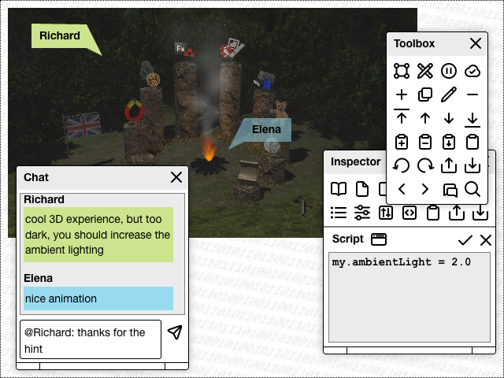

# shareableSketchbook #

a shareable visual Low-Code Playground for Web Technologies

(under active Development, to be released in April 2024)

This is an intermediate step on my way to a modern variant of the famous [Apple HyperCard](https://hypercard.org/) (see also its [Wikipedia article](https://en.wikipedia.org/wiki/HyperCard)).

Back in 1987, HyperCard revolutionized the way ordinary people (i.e., non-programmers) used computers: it turned consumers into producers, unleashing a creativity that was never seen before.

But the world has changed since then.

My idea is therefore to develop a modern variant of HyperCard which only keeps the basic ideas, but uses a completely different technical basis for today's computers.

## License ##

[MIT License](LICENSE.md)
